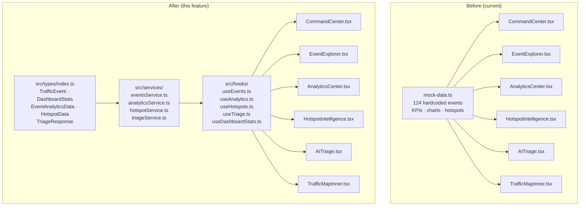
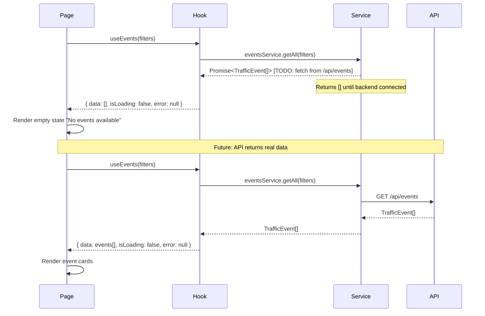
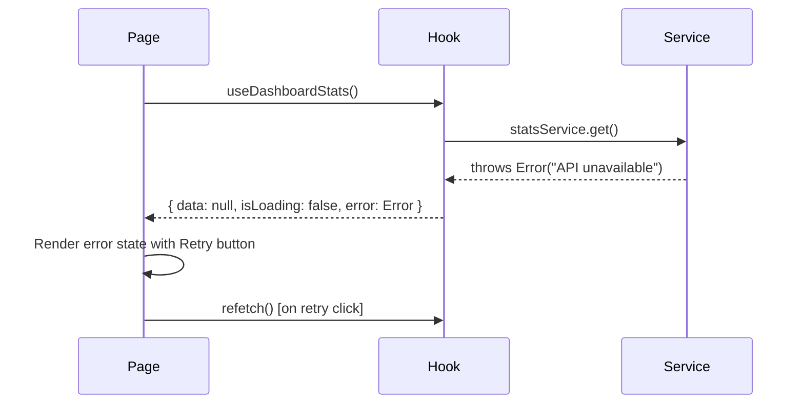

# Design Document: Mock Data Removal

## Overview

The EventWise AI frontend currently sources all displayed data from a single file (`src/lib/mock-data.ts`) containing 124 hardcoded traffic events, KPI values, analytics breakdowns, hotspot rankings, and chart series. This feature removes every piece of mock/fake data and replaces it with an API-ready data layer: TypeScript interfaces in `src/types/`, service stubs in `src/services/`, custom React Query hooks in `src/hooks/`, and proper loading/empty/error UI states in every page component. No visual layout, styling, animation, or routing is changed.

## Architecture



## Sequence Diagrams

### Page Load Flow (after this feature)



### Error State Flow



## Components and Interfaces

### TrafficMapInner

**Current**: imports `TrafficEvent` from `@/lib/mock-data`  
**After**: imports `TrafficEvent` from `@/types`

The component itself stays unchanged — it just needs the type import moved.

### CommandCenter

**Current**: pulls `events`, `kpis`, `liveFeed`, `hotspots` from mock-data  
**After**: pulls from `useDashboardStats()`, `useEvents()`, `useHotspots()` hooks

```typescript
// Before
import { events, kpis, liveFeed, hotspots } from "@/lib/mock-data";

// After
import { useDashboardStats } from "@/hooks/useDashboardStats";
import { useEvents } from "@/hooks/useEvents";
import { useHotspots } from "@/hooks/useHotspots";
```

### EventExplorer

**Current**: imports `events as allEvents` from mock-data; derives `causes` from the array  
**After**: hooks return empty arrays; causes list comes from a constant or future `/api/causes` endpoint

### AnalyticsCenter

**Current**: imports `causeBreakdown`, `priorityBreakdown`, `hourlyTrend`, `weeklyTrend`, `zoneIntelligence` directly  
**After**: `useAnalytics()` hook returns all five slices under a single `AnalyticsData` object

### HotspotIntelligence

**Current**: imports `events` and `hotspots` from mock-data  
**After**: `useHotspots()` for hotspot list; `useEvents()` for map markers

### AITriage

**Current**: uses `setTimeout` with `Math.random()` to simulate a backend call  
**After**: `useTriage()` hook wraps the same stub pattern, ready for real API wiring; the mock random values are replaced by `null` result until the API returns

## Data Models

### `src/types/index.ts`

```typescript
// Re-export all domain types from one place

export type EventStatus = "active" | "monitoring" | "resolved";
export type EventPriority = "critical" | "high" | "medium" | "low";
export type EventCause =
  | "Vehicle Breakdown" | "Accident" | "Construction"
  | "Water Logging" | "Tree Fall" | "Signal Failure"
  | "Protest" | "VIP Movement";
export type VehicleType = "Truck" | "Car" | "Bus" | "Two-Wheeler" | "Auto" | "None";

export interface TrafficEvent {
  id: string;
  code: string;
  cause: EventCause;
  status: EventStatus;
  priority: EventPriority;
  zone: string;
  lat: number;
  lng: number;
  description: string;
  vehicleType: VehicleType;
  createdAt: string;      // ISO 8601
  eta: string;            // human-readable
  closureRisk: number;    // 0–1
  hotspotRisk: number;    // 0–1
  affectedRadius: number; // metres
  reportedBy: string;
  recommendedAction: string;
}

export interface DashboardStats {
  totalEvents: number;
  activeEvents: number;
  highPriority: number;
  roadClosures: number;
  hotspotAlerts: number;
}

export interface CauseBreakdownItem {
  cause: EventCause;
  count: number;
}

export interface PriorityBreakdownItem {
  priority: EventPriority;
  count: number;
}

export interface HourlyTrendItem {
  hour: string;   // "HH:00"
  events: number;
  critical: number;
}

export interface WeeklyTrendItem {
  day: string;    // "Mon" … "Sun"
  resolved: number;
  active: number;
}

export interface ZoneIntelligenceItem {
  zone: string;
  events: number;
  risk: number;   // 0–100
}

export interface EventAnalyticsData {
  causeBreakdown: CauseBreakdownItem[];
  priorityBreakdown: PriorityBreakdownItem[];
  hourlyTrend: HourlyTrendItem[];
  weeklyTrend: WeeklyTrendItem[];
  zoneIntelligence: ZoneIntelligenceItem[];
}

export interface HotspotData {
  id: string;
  zone: string;
  rank: number;
  risk: number;   // 0–100
  cluster: number;
  trend: "up" | "down";
  change: number; // percentage delta
}

export interface TriageRequest {
  eventType: string;
  cause: string;
  zone: string;
  vehicle: string;
  lat: string;
  lng: string;
  time: string;
}

export interface TriageSignal {
  k: string;
  v: string;
}

export interface TriageResponse {
  priorityScore: number;
  priorityLabel: "CRITICAL" | "HIGH" | "MEDIUM" | "LOW";
  closure: number;  // 0–100
  hotspot: number;  // 0–100
  eta: string;
  response: string;
  signals: TriageSignal[];
}
```

### Validation Rules

- `TrafficEvent.closureRisk` and `hotspotRisk` must be in range [0, 1]
- `TrafficEvent.affectedRadius` is positive integer (metres)
- `DashboardStats` counts are non-negative integers
- `HotspotData.risk` is in range [0, 100]
- `TriageResponse.priorityScore` is in range [0, 100]

## Service Layer Structure

### `src/services/eventsService.ts`

```typescript
import type { TrafficEvent } from "@/types";

export interface EventsFilter {
  priority?: string | null;
  cause?: string | null;
  query?: string | null;
}

const eventsService = {
  // TODO: Fetch from backend GET /api/events
  getAll: async (_filters?: EventsFilter): Promise<TrafficEvent[]> => {
    return [];
  },

  // TODO: Fetch from backend GET /api/events/live-feed
  getLiveFeed: async (): Promise<TrafficEvent[]> => {
    return [];
  },

  // TODO: Fetch from backend GET /api/events/:id
  getById: async (_id: string): Promise<TrafficEvent | null> => {
    return null;
  },
};

export default eventsService;
```

### `src/services/analyticsService.ts`

```typescript
import type { EventAnalyticsData } from "@/types";

const analyticsService = {
  // TODO: Fetch from backend GET /api/analytics
  get: async (): Promise<EventAnalyticsData | null> => {
    return null;
  },
};

export default analyticsService;
```

### `src/services/hotspotService.ts`

```typescript
import type { HotspotData, DashboardStats } from "@/types";

const hotspotService = {
  // TODO: Fetch from backend GET /api/hotspots
  getAll: async (): Promise<HotspotData[]> => {
    return [];
  },

  // TODO: Fetch from backend GET /api/stats
  getStats: async (): Promise<DashboardStats | null> => {
    return null;
  },
};

export default hotspotService;
```

### `src/services/triageService.ts`

```typescript
import type { TriageRequest, TriageResponse } from "@/types";

const triageService = {
  // TODO: POST to backend /api/triage
  run: async (_req: TriageRequest): Promise<TriageResponse | null> => {
    return null;
  },
};

export default triageService;
```

## Custom Hooks

All hooks use `@tanstack/react-query` (already in `package.json`) for cache management and query state.

### `src/hooks/useEvents.ts`

```typescript
import { useQuery } from "@tanstack/react-query";
import eventsService, { type EventsFilter } from "@/services/eventsService";

export function useEvents(filters?: EventsFilter) {
  return useQuery({
    queryKey: ["events", filters],
    queryFn: () => eventsService.getAll(filters),
  });
}

export function useLiveFeed() {
  return useQuery({
    queryKey: ["events", "live-feed"],
    queryFn: () => eventsService.getLiveFeed(),
  });
}
```

### `src/hooks/useDashboardStats.ts`

```typescript
import { useQuery } from "@tanstack/react-query";
import hotspotService from "@/services/hotspotService";

export function useDashboardStats() {
  return useQuery({
    queryKey: ["dashboard-stats"],
    queryFn: () => hotspotService.getStats(),
  });
}
```

### `src/hooks/useAnalytics.ts`

```typescript
import { useQuery } from "@tanstack/react-query";
import analyticsService from "@/services/analyticsService";

export function useAnalytics() {
  return useQuery({
    queryKey: ["analytics"],
    queryFn: () => analyticsService.get(),
  });
}
```

### `src/hooks/useHotspots.ts`

```typescript
import { useQuery } from "@tanstack/react-query";
import hotspotService from "@/services/hotspotService";

export function useHotspots() {
  return useQuery({
    queryKey: ["hotspots"],
    queryFn: () => hotspotService.getAll(),
  });
}
```

### `src/hooks/useTriage.ts`

```typescript
import { useMutation } from "@tanstack/react-query";
import triageService from "@/services/triageService";
import type { TriageRequest } from "@/types";

export function useTriage() {
  return useMutation({
    mutationFn: (req: TriageRequest) => triageService.run(req),
  });
}
```

## Loading / Empty / Error State Patterns

Each page that consumes a hook must handle three states. The existing Skeleton component (`src/components/ui/skeleton.tsx`) is used for loading.

### Loading State — KPI pills (CommandCenter)

```typescript
// When isLoading: render skeleton pills matching the current shape
{isLoading ? (
  <>
    <Skeleton className="h-8 w-24 rounded-full" />
    <Skeleton className="h-8 w-24 rounded-full" />
    <Skeleton className="h-8 w-24 rounded-full" />
  </>
) : (
  // real KpiPill components
)}
```

### Empty State — Event list (EventExplorer)

```typescript
{!isLoading && events.length === 0 && (
  <div className="grid h-full place-items-center text-sm text-muted-foreground">
    <div className="text-center">
      <div className="mx-auto grid h-12 w-12 place-items-center rounded-full border border-border">
        <Search className="h-5 w-5" />
      </div>
      <p className="mt-3">No events available.</p>
    </div>
  </div>
)}
```

### Error State — with Retry (any page)

```typescript
{error && (
  <div className="grid h-full place-items-center text-center text-sm text-muted-foreground">
    <div>
      <AlertTriangle className="mx-auto h-8 w-8 text-destructive" />
      <p className="mt-3 font-semibold text-foreground">Failed to load data</p>
      <p className="mt-1 text-xs">API unavailable</p>
      <button
        onClick={() => refetch()}
        className="mt-4 rounded-lg border border-border px-4 py-2 text-xs hover:bg-surface-elevated"
      >
        Retry
      </button>
    </div>
  </div>
)}
```

## Error Handling

| Scenario | Component | Response |
|---|---|---|
| Service returns `null` | All pages | Render empty state message |
| Service returns `[]` | List/chart pages | Render empty state message |
| Service throws | All pages | Render error state with Retry |
| Map receives `[]` events | TrafficMap | Renders empty map (no markers) — already valid |
| Analytics all zeros | AnalyticsCenter | Charts render with empty series — already valid in recharts |

## File Deletions & Migrations

| Action | File |
|---|---|
| **Delete** | `src/lib/mock-data.ts` |
| **Keep, update imports** | `src/lib/store.ts` (change `TrafficEvent` import to `@/types`) |
| **Keep, update imports** | `src/components/TrafficMap.tsx` (change `TrafficEvent` import to `@/types`) |
| **Keep, update imports** | `src/components/TrafficMapInner.tsx` (change `TrafficEvent` import to `@/types`) |
| **Rewrite data consumption** | `src/pages/CommandCenter.tsx` |
| **Rewrite data consumption** | `src/pages/EventExplorer.tsx` |
| **Rewrite data consumption** | `src/pages/AnalyticsCenter.tsx` |
| **Rewrite data consumption** | `src/pages/HotspotIntelligence.tsx` |
| **Rewrite data consumption** | `src/pages/AITriage.tsx` |

## Testing Strategy

### Unit Testing Approach

Each service function should be testable by verifying it returns the correct empty/null value synchronously (no network needed until backend is wired).

```typescript
// Example: eventsService.getAll returns []
expect(await eventsService.getAll()).toEqual([]);
expect(await eventsService.getAll({ priority: "critical" })).toEqual([]);
```

### Property-Based Testing Approach

Not applicable for the stub phase. Once real API data flows, property tests should verify:
- All returned `TrafficEvent` objects satisfy the interface contract (risk values in [0,1], required fields present)
- Filter functions are monotone: adding a filter never increases result count

**Property Test Library**: fast-check (can be added when backend integration begins)

### Integration Testing Approach

After backend is connected, integration tests should:
1. Mount each page with a React Query provider and mock API server
2. Verify loading skeleton renders then disappears
3. Verify empty state renders when server returns `[]`
4. Verify error state + Retry button renders when server throws

## Performance Considerations

- `@tanstack/react-query` caches results by query key; removing mock data does not regress perceived performance since all stub calls are synchronous no-ops resolving immediately.
- Chart components (`recharts`) handle empty `data={[]}` gracefully — no special casing needed.
- The Leaflet map handles `events={[]}` gracefully — renders base tiles with no markers.

## Security Considerations

- No sensitive data is introduced. The stub services return empty structures.
- When real API calls are added (future), all fetch calls should use the project's existing HTTP client pattern with appropriate CORS and authentication headers.

## Dependencies

No new npm packages are required. The following already-installed packages are used:

| Package | Usage |
|---|---|
| `@tanstack/react-query` | Hook data fetching, cache, loading/error state |
| `zustand` | `useCommandStore` — unchanged, just type import updated |
| `src/components/ui/skeleton.tsx` | Skeleton loading placeholders |
| `lucide-react` | `AlertTriangle` icon in error states |

## Correctness Properties

These are invariants that must hold throughout the implementation, verifiable as assertions or automated tests.

### Property 1: Services always return the correct empty type

**Validates: Requirements 3.1, 3.2, 3.3, 3.4**

For any service stub function, calling it with any input must return the declared empty value — never `undefined`, and never a value of the wrong shape.

```typescript
// All of these must be true after implementation:
assert(await eventsService.getAll() instanceof Array)
assert(await eventsService.getLiveFeed() instanceof Array)
assert(await eventsService.getById("any") === null)
assert(await analyticsService.get() === null)
assert(await hotspotService.getAll() instanceof Array)
assert(await hotspotService.getStats() === null)
assert(await triageService.run(anyReq) === null)
```

### Property 2: No mock-data.ts import exists after cleanup

**Validates: Requirements 1.1, 1.2, 1.3, 1.4, 1.5, 1.6**

∀ file f in `src/`: `f` does not contain the string `"mock-data"` after Task 18.

### Property 3: TrafficEvent interface contract

**Validates: Requirements 2.1, 2.6**

For any `TrafficEvent` object (once real data flows), the following invariants hold:

```typescript
// closureRisk and hotspotRisk are in [0, 1]
assert(event.closureRisk >= 0 && event.closureRisk <= 1)
assert(event.hotspotRisk >= 0 && event.hotspotRisk <= 1)
// affectedRadius is a positive integer
assert(event.affectedRadius > 0 && Number.isInteger(event.affectedRadius))
// required string fields are non-empty
assert(event.id.length > 0)
assert(event.cause.length > 0)
assert(event.zone.length > 0)
```

### Property 4: DashboardStats values are non-negative integers

**Validates: Requirements 2.2**

```typescript
// For any DashboardStats object returned by the API:
const fields = ["totalEvents", "activeEvents", "highPriority", "roadClosures", "hotspotAlerts"]
fields.forEach(f => {
  assert(stats[f] >= 0)
  assert(Number.isInteger(stats[f]))
})
```

### Property 5: HotspotData risk is bounded

**Validates: Requirements 2.4**

```typescript
// For any HotspotData object:
assert(hotspot.risk >= 0 && hotspot.risk <= 100)
assert(hotspot.trend === "up" || hotspot.trend === "down")
assert(hotspot.rank >= 1)
```

### Property 6: TriageResponse score is bounded

**Validates: Requirements 2.5**

```typescript
// For any TriageResponse:
assert(response.priorityScore >= 0 && response.priorityScore <= 100)
assert(["CRITICAL", "HIGH", "MEDIUM", "LOW"].includes(response.priorityLabel))
assert(response.closure >= 0 && response.closure <= 100)
assert(response.hotspot >= 0 && response.hotspot <= 100)
assert(Array.isArray(response.signals))
```

### Property 7: Components render without crash on empty data

**Validates: Requirements 9.2**

For each page component, passing empty/null data must not throw:

```typescript
// These renders must complete without thrown errors:
render(<TrafficMap events={[]} />)                    // empty map, no markers
render(<CommandCenter />) // with hooks returning []  // shows empty states
render(<AnalyticsCenter />) // with hook returning null // shows waiting state
render(<EventExplorer />) // with hook returning []   // shows empty state
render(<HotspotIntelligence />) // with hooks returning [] // shows empty state
```
